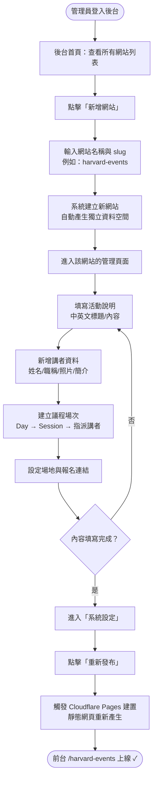

# 簡化版 PRD — Seminar CMS 學術研討會多站點管理系統

---

## 1. 產品概述

### 願景

打造一個**簡單易用的研討會網站管理平台**，讓非技術背景的行政人員也能在同一個後台建立並管理多個獨立的學術研討會網站，無需撰寫任何程式碼。所有網站共用同一套前端版型，只需填入不同內容即可快速上線。

### 目標用戶

| 用戶角色 | 描述 | 核心需求 |
|---------|------|---------|
| **活動行政人員** | 負責研討會籌備的非技術人員 | 能自行建站、上架/更新活動資訊，不需要找工程師 |
| **學術主辦單位** | 大學、基金會、NGO 等組織 | 快速產出專業的活動網站，支援中英雙語 |
| **與會者（一般大眾）** | 瀏覽活動資訊、查看議程與講者 | 快速找到活動時間、地點、講者資訊並完成報名 |

---

## 2. 核心功能

| 優先級 | 功能 | 說明 |
|-------|------|------|
| P0 | **建立不同 slug 的網站** | 管理員可以新增 `/harvard-events`、`/hualien-events` 等不同網址 |
| P0 | **每個 slug 有自己的資料** | 同一個後台，但哈佛網站只看哈佛的議程、講者、展覽 |
| P0 | **共用前端版型** | 所有網站的外觀、選單、排版都一樣，只有內容不同 |

---

## 3. User Story：建立不同 slug 的網站

> **身為**活動行政人員，  
> **我想要**在後台快速建立一個新的活動網站（指定獨立的 slug 網址），並為它填入專屬的議程、講者等資料，  
> **以便**每場研討會都有獨立的網站，而我不需要重新架站或請工程師協助。

**驗收條件（Acceptance Criteria）：**

- [ ] 管理員可在後台首頁點擊「新增網站」
- [ ] 可輸入網站名稱與自訂 slug（如 `harvard-events`）
- [ ] 建立後，該網站擁有獨立的議程、講者、場地等資料區域
- [ ] 不同 slug 的資料完全隔離，互不干擾
- [ ] 前台可透過 `/{slug}` 網址存取對應網站
- [ ] 所有網站共用相同的前端版型與排版

---

## 4. 流程圖：建立新活動網站並上線

